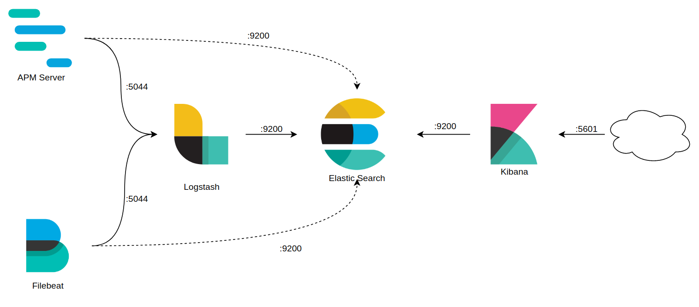

# Monitoring Stack

Kubernetes manifests for common monitoring services

## Services and Configurations

1. [x] `Zabbix`
   1. [x] `Zabbix Web`
   2. [x] `Server`
2. [x] `Grafana`
3. [ ] `Prometheus`
4. [ ] `ELK`
   1. [x] `Elastic Search`
   2. [x] `Logstash`
   3. [x] `Kibana`
   4. [x] `APM Server`
   5. [ ] `Filebeat`
   6. [ ] `Curator`

## Misc

1. `Dashboard`: https://raw.githubusercontent.com/kubernetes/dashboard/v2.0.0/aio/deploy/recommended.yaml
2. `Metrics Server`: https://github.com/kubernetes-sigs/metrics-server/releases/download/v0.3.7/components.yaml

## Ingress Configuration
